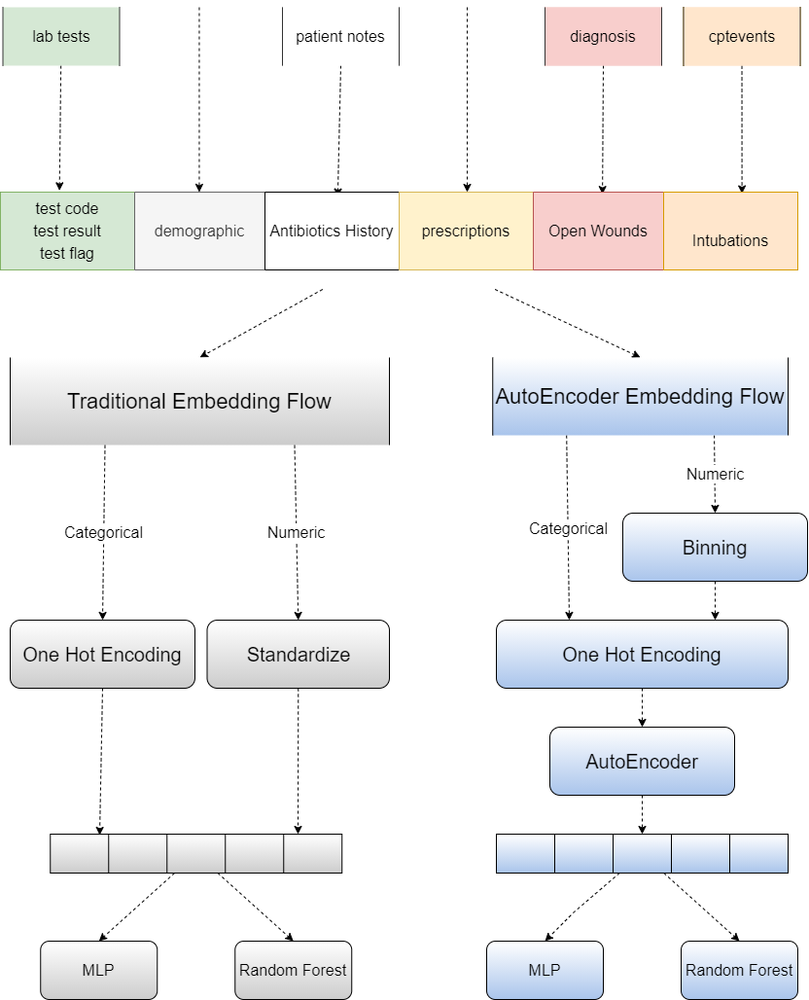
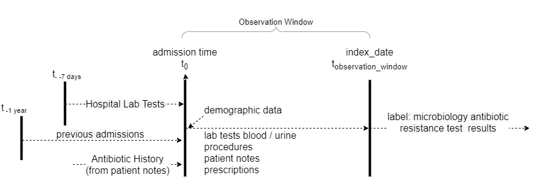

# Early Predictions of ESBL in Hopsitals

```
Noam Mansovsky, Tatiana Sokolinski, James Coffey
2021 May
Deep Learning For Health, Prof. Sun, University of Illinois URbana Champaign
```


## Usage:

### Jupyter

Run the steps in `main.ipynb` notebook

1. build dataset *( Note: The code here includes a ready dataset file, no need to run this step)* 

2. Random Forest model: train and evaluate

3. MLP: train and evaluate

*Performance Note:* A GPU is recommended for training of AutoEncoder and MLP models, otherwise it takes a long time.

### Sample Run:

A sample dataset was provided with the code for demonstrating model training and testing.
The below commands train and evaluate the RandomForest model:

```bash
pip install -r requirements.txt
python demo.py
```

## Processing Flow



## Data Sources




### Navigation:

`main.ipynb`: Complete flow. run dataset building and training of models.

`hyper_params.py`: Hyper Parameters

`dataset.py`: generates datasets for training and testing

`baseline_model.py`: Random Forest models

`MLP.py`: MLP model

`config.py`: file location constants, etc.

`requirements.txt`: Dependencies

`./embeddings`: AutoEncoder code

`./dataproc`: data processing modules
